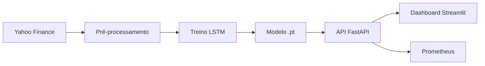
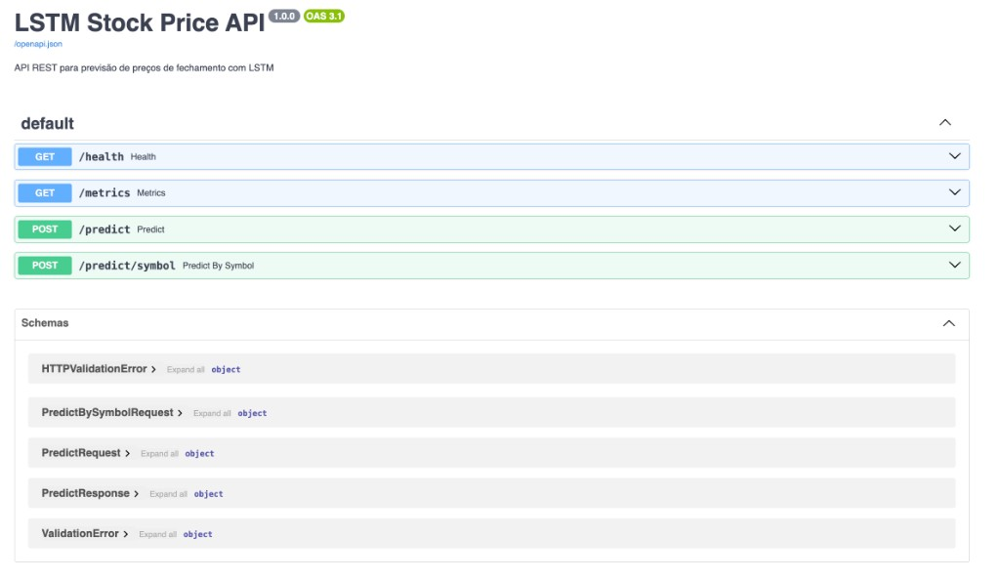
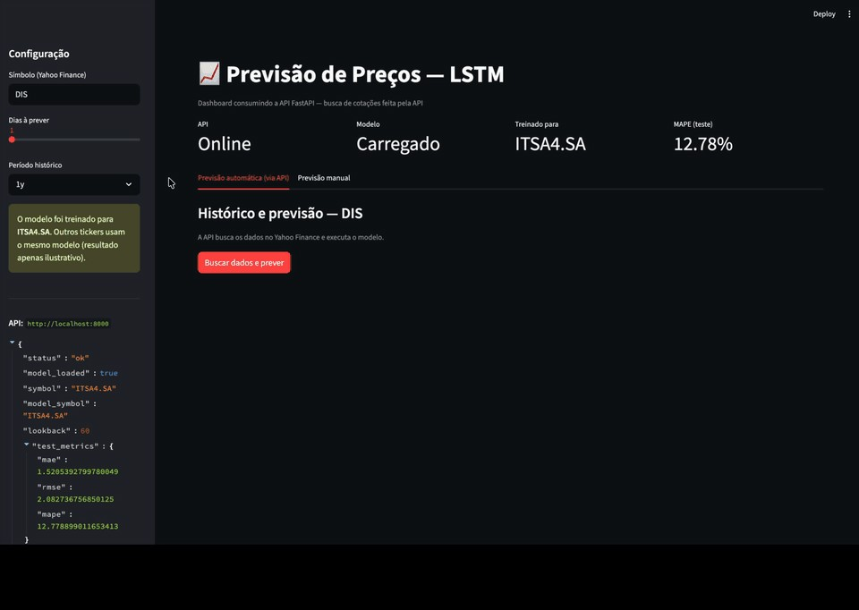
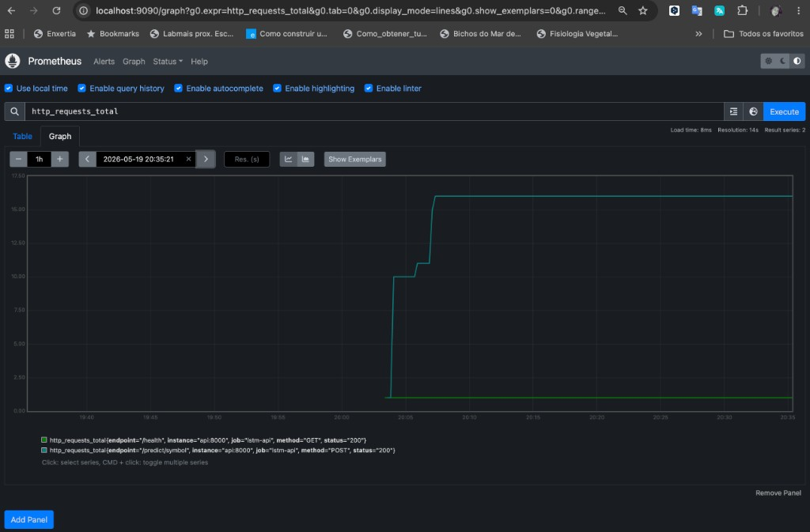
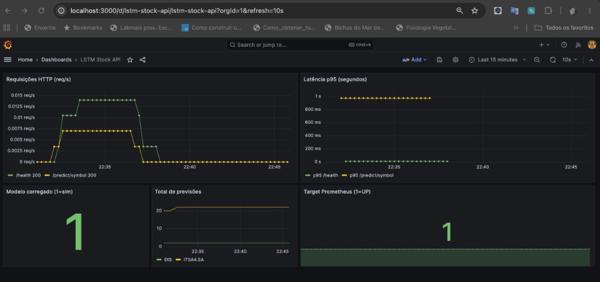

# m4-ml-lstm-bv-price

Projeto end-to-end de previsão de preços de fechamento de ações com **LSTM**, incluindo coleta de dados (Yahoo Finance), treinamento, API REST (FastAPI), monitoramento (Prometheus/Grafana) e dashboard (Streamlit).

## Visão geral da pipeline

O projeto implementa uma **pipeline MLOps completa** para prever o **preço de fechamento** de ações. O fluxo vai da coleta de dados históricos até a inferência em produção via API e dashboard.



| Etapa | Script / componente | Saída principal |
|-------|----------------------|-----------------|
| 1. Coleta | `src/data/download.py` | `data/raw/{SYMBOL}_historical.csv` |
| 2. Pré-processamento | `src/data/preprocess.py` | `data/processed/{SYMBOL}_sequences.npz` |
| 3. Treinamento | `src/model/train.py` | `models/lstm_{SYMBOL}.pt` |
| 4. Avaliação | `src/model/evaluate.py` | `reports/{SYMBOL}_test_metrics.json` |
| 5. Deploy | `src/api/main.py` | API REST em `:8000` |
| 6. Consumo | `dashboard/app.py` | Interface em `:8501` |
| 7. Monitoramento | `src/monitoring/metrics.py` | `/metrics` → Prometheus/Grafana |

---

## Pipeline detalhada

### 1. Coleta de dados (`src/data/download.py`)

Utiliza a biblioteca **yfinance** para baixar preços históricos do ticker configurado em `.env` (padrão: `DIS` — Disney).

- Período padrão: `2018-01-01` a `2024-07-20`
- Colunas: Open, High, Low, Close, Volume
- O CSV em `data/raw/` garante **reprodutibilidade** (o treino não depende de rede a cada execução)

```bash
python -m src.data.download
```

---

### 2. Pré-processamento (`src/data/preprocess.py`)

Transforma a série temporal em formato adequado para a LSTM:

| Passo | Descrição |
|-------|-----------|
| Limpeza | Remove `NaN`, ordena por data |
| Normalização | `MinMaxScaler` ajustado **apenas no conjunto de treino** (evita *data leakage*) |
| Janelas | `lookback=60` dias de entrada → previsão do próximo fechamento |
| Split temporal | 70% treino / 15% validação / 15% teste (sem embaralhar) |

**Artefatos:** `data/processed/{SYMBOL}_sequences.npz` e `models/scaler_{SYMBOL}.pkl`

```bash
python -m src.data.preprocess
```

---

### 3. Modelo LSTM (`src/model/lstm.py` + `train.py`)

Rede neural **LSTM** (PyTorch) para capturar padrões temporais:

```
Entrada (60 dias × Close)
  → LSTM (50 unidades) + Dropout
  → LSTM (50 unidades) + Dropout
  → Dense (1) → preço previsto
```

- **Treino:** Adam, loss MSE, early stopping na validação
- **Checkpoint:** salva o melhor modelo em `models/lstm_{SYMBOL}.pt`
- **Metadados:** hiperparâmetros e métricas em `models/metadata_{SYMBOL}.json`

```bash
python -m src.model.train
```

---

### 4. Avaliação (`src/model/evaluate.py` + `metrics.py`)

Métricas calculadas no **conjunto de teste** (dados não vistos no treino):

| Métrica | Significado |
|---------|-------------|
| **MAE** | Erro absoluto médio (US$) |
| **RMSE** | Raiz do erro quadrático médio |
| **MAPE** | Erro percentual absoluto médio |

Gera também o gráfico `reports/{SYMBOL}_predictions.png` (série real vs prevista).

```bash
python -m src.model.evaluate
```

---

### 5. Salvamento e inferência (`src/model/io.py` + `predict.py`)

| Arquivo | Função |
|---------|--------|
| `lstm_{SYMBOL}.pt` | Pesos da rede (PyTorch) |
| `scaler_{SYMBOL}.pkl` | Normalizador para inferência |
| `metadata_{SYMBOL}.json` | Configuração e métricas do treino |

A inferência recebe os últimos `lookback` preços, normaliza, executa o modelo e desnormaliza o resultado. Suporta previsão de múltiplos dias (`steps`) de forma recursiva.

---

### 6. API REST — Deploy (`src/api/main.py`)

API **FastAPI** que expõe o modelo em produção:

| Método | Rota | Descrição |
|--------|------|-----------|
| `GET` | `/health` | Status, modelo carregado, métricas de teste |
| `POST` | `/predict` | Previsão a partir de lista de preços históricos |
| `POST` | `/predict/symbol` | API busca cotações no Yahoo Finance e prevê |
| `GET` | `/metrics` | Métricas Prometheus (latência, volume, etc.) |

```bash
uvicorn src.api.main:app --reload --host 0.0.0.0 --port 8000
```

Documentação interativa (Swagger): http://localhost:8000/docs



| Endpoint | Método | Descrição |
|----------|--------|-----------|
| `/health` | `GET` | Status da API e do modelo |
| `/metrics` | `GET` | Métricas Prometheus |
| `/predict` | `POST` | Previsão com lista de preços |
| `/predict/symbol` | `POST` | Previsão buscando cotações no Yahoo Finance |

> **Nota:** O modelo é treinado para um ticker (`SYMBOL` no `.env`). Previsões para outros símbolos retornam um `warning` na resposta — para produção real, retreine com o novo ticker.

---

### 7. Dashboard (`dashboard/app.py`)

Interface **Streamlit** que consome a API:

- **Previsão automática:** chama `POST /predict/symbol` (API busca dados e prevê)
- **Previsão manual:** envia histórico de preços via `POST /predict`
- Exibe status da API, métricas de teste e gráfico dos últimos fechamentos

```bash
# Terminal 1: API
uvicorn src.api.main:app --reload --port 8000

# Terminal 2: Dashboard
python -m streamlit run dashboard/app.py
```

Acesse: http://localhost:8501

**Dashboard** (status da API, previsão automática e configuração na barra lateral):



| Área | Função |
|------|--------|
| Métricas no topo | Status da API, modelo carregado, ticker treinado e MAPE de teste |
| Aba automática | API busca cotações no Yahoo Finance e executa o modelo |
| Aba manual | Envio de histórico de preços (mínimo 60 fechamentos) |
| Barra lateral | Símbolo, dias à prever, período histórico e JSON do `/health` |

---

### 8. Monitoramento (`src/monitoring/metrics.py` + Docker)

Métricas expostas em `GET /metrics` para o **Prometheus**:

- `http_request_duration_seconds` — latência por rota
- `http_requests_total` — volume de requisições
- `predictions_total` — previsões servidas
- `model_loaded` — modelo disponível (0/1)

```bash
docker compose up --build
```

| Serviço | URL |
|---------|-----|
| API | http://localhost:8000 |
| Prometheus | http://localhost:9090 |
| Grafana | http://localhost:3000 (admin/admin) |

---

## Deploy na nuvem (Render)

> **API não publicada:** A API **não foi implantada em produção** na nuvem devido aos **custos** da publicação contínua no [Render](https://render.com) (limitações do plano gratuito — sem disco persistente e sem `preDeployCommand` — e cobrança em planos pagos para recursos como persistência de modelo e treino automático no deploy).

A inferência e o consumo via dashboard estão documentados para execução **local** ou via **Docker Compose** (seções anteriores deste README).

Caso seja necessário publicar a aplicação, o repositório inclui o arquivo **[`render.yaml`](render.yaml)** (Blueprint Render) com a configuração de referência para:

| Serviço | Descrição |
|---------|-----------|
| `lstm-api` | API FastAPI (runtime Docker) |
| `lstm-dashboard` | Dashboard Streamlit |

**Como usar o Blueprint (se desejar publicar):**

1. Conecte o repositório em [Render → Blueprints](https://dashboard.render.com/blueprints).
2. Informe o caminho `render.yaml` na raiz do projeto.
3. Ajuste variáveis (`SYMBOL`, datas, etc.) no painel, se necessário.
4. No plano gratuito, inclua os artefatos treinados em `models/` no repositório ou execute o treino manualmente pelo Shell do serviço após o deploy.

---

## Documentação de funções

Referência completa de funções, classes e endpoints: **[docs/FUNCTIONS.md](docs/FUNCTIONS.md)**

Cada módulo Python também possui **docstrings** (visíveis no IDE e via `help()`).

---

## Estrutura do projeto

```
├── data/raw/              # CSV baixado do Yahoo Finance
├── data/processed/        # Sequências para o LSTM (.npz)
├── models/                # Modelo .pt, scaler .pkl, metadata .json
├── reports/               # Métricas e gráficos de avaliação
├── src/
│   ├── data/              # download + preprocess
│   ├── model/             # LSTM, train, evaluate, predict
│   ├── api/               # FastAPI
│   └── monitoring/        # Métricas Prometheus
├── dashboard/             # Streamlit
├── docs/images/           # Capturas (Dashboard, Swagger, Prometheus, Grafana)
├── tests/
├── docker-compose.yml     # API + Prometheus + Grafana
├── render.yaml            # Blueprint Render (deploy opcional na nuvem)
└── requirements.txt
```

## Pré-requisitos

- Python 3.10+
- (Opcional) Docker e Docker Compose

## Configuração rápida

```bash
# 1. Clonar e entrar no projeto
cd m4-ml-lstm-bv-price

# 2. Ambiente virtual (Python 3.11+ recomendado; modelo usa PyTorch)
python3.11 -m venv .venv
source .venv/bin/activate   # Windows: .venv\Scripts\activate

# 3. Dependências
pip install -r requirements.txt

# Confirme que o Python do venv é 3.11:
python --version   # deve mostrar Python 3.11.x

# 4. Variáveis de ambiente
cp .env.example .env
# Edite .env se quiser outro ticker (ex.: PETR4.SA, AAPL)
```

## Execução rápida da pipeline

```bash
source .venv/bin/activate

# Pipeline ML completa
python -m src.data.download
python -m src.data.preprocess
python -m src.model.train
python -m src.model.evaluate

# Deploy e consumo
uvicorn src.api.main:app --reload --port 8000          # terminal 1
python -m streamlit run dashboard/app.py               # terminal 2
```

Ou use o Makefile:

```bash
make pipeline    # download + preprocess + train + evaluate
make api         # sobe a API
make dashboard   # sobe o Streamlit
```

### Exemplo — previsão via API

```bash
# Health check
curl http://localhost:8000/health

# Previsão por símbolo (API busca no Yahoo Finance)
curl -X POST http://localhost:8000/predict/symbol \
  -H "Content-Type: application/json" \
  -d '{"symbol": "DIS", "steps": 1, "period": "1y"}'
```

## Docker — pipeline e containers

### Pré-requisitos

- Docker e Docker Compose instalados
- Arquivo `.env` configurado: `cp .env.example .env`

### Opção A — Pipeline local + containers (recomendado)

Treine no venv e suba só API + monitoramento:

```bash
cd m4-ml-lstm-bv-price
source .venv/bin/activate

# 1) Pipeline ML
python -m src.data.download
python -m src.data.preprocess
python -m src.model.train
python -m src.model.evaluate

# 2) Containers (API + Prometheus + Grafana)
docker compose build
docker compose up -d

# 3) Verificar
curl http://localhost:8000/health
docker compose ps
docker compose logs -f api
```

### Opção B — Pipeline inteira dentro do Docker

```bash
cd m4-ml-lstm-bv-price
cp .env.example .env

docker compose build

# Pipeline ML (one-off no container da API)
docker compose run --rm api python -m src.data.download
docker compose run --rm api python -m src.data.preprocess
docker compose run --rm api python -m src.model.train
docker compose run --rm api python -m src.model.evaluate

# Subir stack em produção
docker compose up -d
```

### URLs dos serviços

| Serviço | URL |
|---------|-----|
| API | http://localhost:8000 |
| Swagger | http://localhost:8000/docs |
| Prometheus | http://localhost:9090 |
| Grafana | http://localhost:3000 (admin/admin) |

### Grafana e Prometheus

1. **Prometheus** só armazena métricas que a API expõe em `/metrics`.
2. **Contadores** (`http_requests_total`, `predictions_total`) só aumentam quando alguém **chama a API**.
3. **Grafana** precisa de data source + dashboard (o projeto provisiona automaticamente após `docker compose up -d`).

**Recriar Grafana com provisioning** (se já subiu antes sem os arquivos novos):

```bash
docker compose down
docker compose up -d
```

**Gerar tráfego para aparecer gráfico:**

```bash
curl http://localhost:8000/health
curl -X POST http://localhost:8000/predict/symbol \
  -H "Content-Type: application/json" \
  -d '{"symbol": "DIS", "steps": 1, "period": "1y"}'
```

**Prometheus** (http://localhost:9090): **Status → Targets** → `lstm-api` = **UP**.  
**Graph**: digite `http_requests_total` ou `model_loaded` → Execute.

**Prometheus** (métrica `http_requests_total` após gerar tráfego na API):



| Série | Labels | Descrição |
|-------|--------|-----------|
| `/health` | `method=GET`, `status=200` | Requisições ao health check |
| `/predict/symbol` | `method=POST`, `status=200` | Previsões por símbolo via Yahoo Finance |

**Grafana**: login `admin` / `admin` → **Dashboards** → **LSTM Stock API**.

**Grafana** (após gerar tráfego na API):



| Painel | Métrica |
|--------|---------|
| Requisições HTTP | Taxa de requisições por rota (`/health`, `/predict/symbol`) |
| Latência p95 | Percentil 95 da latência por endpoint |
| Modelo carregado | `model_loaded` (1 = modelo em memória) |
| Total de previsões | `predictions_total` por símbolo |
| Target Prometheus | Status do scrape da API (`up` = 1) |

Configuração manual (se necessário): **Connections → Data sources → Add Prometheus** → URL `http://prometheus:9090`.

### Dashboard (fora do Docker)

O Streamlit roda no host apontando para a API no container:

```bash
source .venv/bin/activate
export API_URL=http://localhost:8000
python -m streamlit run dashboard/app.py
```

### Comandos úteis Docker

```bash
docker compose up -d          # sobe em background
docker compose up --build     # rebuild + sobe
docker compose down           # para e remove containers
docker compose logs -f api    # logs da API
docker compose restart api    # reinicia só a API
```

---

## Testes

```bash
pytest tests/ -v
# ou: make test
```

## Variáveis de ambiente (.env)

| Variável | Padrão | Descrição |
|----------|--------|-----------|
| `SYMBOL` | `DIS` | Ticker Yahoo Finance |
| `START_DATE` | `2018-01-01` | Início do histórico |
| `END_DATE` | `2024-07-20` | Fim do histórico |
| `LOOKBACK` | `60` | Janela temporal (dias) |
| `LSTM_UNITS` | `50` | Unidades LSTM |
| `EPOCHS` | `100` | Épocas máximas |
| `BATCH_SIZE` | `32` | Tamanho do batch |

## Checklist do Tech Challenge

- [x] Coleta com yfinance
- [x] Pré-processamento com split temporal e scaler no treino
- [x] Modelo LSTM com early stopping
- [x] Métricas MAE, RMSE, MAPE
- [x] Salvamento do modelo e scaler
- [x] API REST FastAPI (execução local / Docker; **não publicada na nuvem** — ver [Deploy na nuvem (Render)](#deploy-na-nuvem-render))
- [x] Monitoramento Prometheus
- [x] Dashboard Streamlit
- [x] Blueprint Render (`render.yaml`) disponível para deploy opcional

## Problemas no Mac (AVX / TensorFlow)

Se aparecer `TensorFlow was compiled to use AVX instructions`, o projeto usa **PyTorch** (sem exigência AVX). Reinstale as dependências:

```bash
pip uninstall tensorflow tensorflow-io-gcs-filesystem -y
pip install -r requirements.txt
python -c "import torch; print(torch.__version__)"
```

## Aviso

Este projeto é **educacional**. Previsões de mercado financeiro são incertas; não use como recomendação de investimento.
